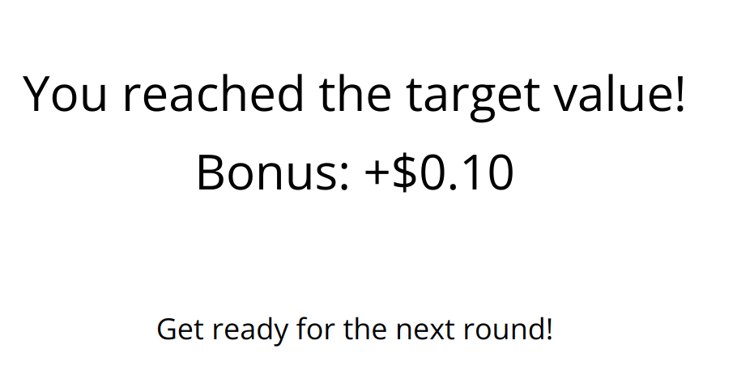
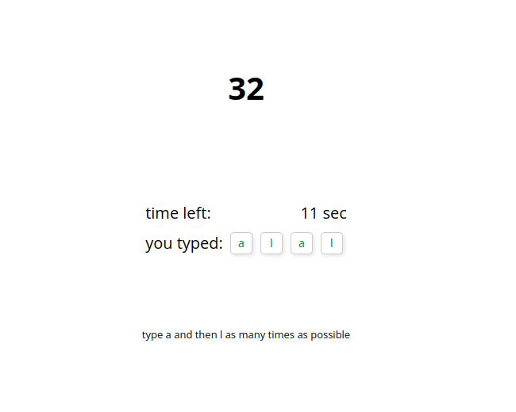
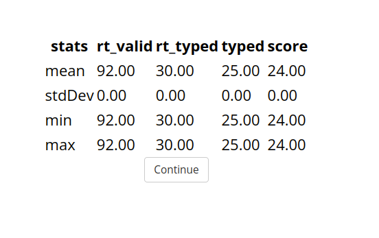
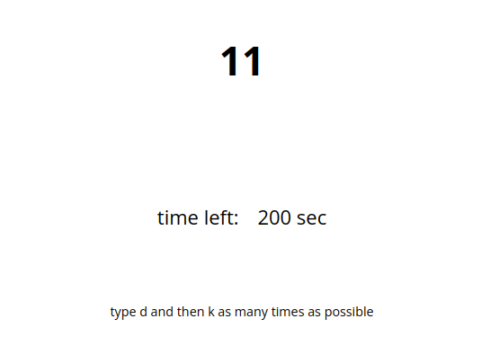

## Apr 12

A couple of updates:

1. The data is saved in a specific format. `rt` represents the time taken by participants to start typing since the trial began, regardless of whether their response is correct or not. We then use the `JSON2CSV` method from the `JsPsych` library to convert the JSON object to CSV. Turn off format checking in `DataPipe` so this record can be successfully saved on OSF.
  
https://github.com/dennislx/jspsych-typing/blob/9acfff870b5c5307c4f5d0c7cebdc89639bca42d/src/utils.js#L260-L278

2. Two lines are added to recommend participants using two index fingers for the task. The local static URL to load an image will not work since the experiment is hosted on a GitHub repository. Instead I use a public URL of the image path to make it work.

https://github.com/dennislx/jspsych-typing/blob/9acfff870b5c5307c4f5d0c7cebdc89639bca42d/public/configs/default.yaml#L178-L180

3. Changes are made to the feedback given when participants fail the task twice in a row. This applies to both the continuous and binary streak groups.

https://github.com/dennislx/jspsych-typing/blob/9acfff870b5c5307c4f5d0c7cebdc89639bca42d/src/jspsych-typing.js#L411-L417


## Mar 28

Inform participants on the instruction page they are seeing examples in the following pages. 

https://github.com/dennislx/jspsych-typing/blob/21f765ba15425787e02e559854259d3c13e449a2/public/configs/default.yaml#L199-L207

## Mar 24

Two updates:

1. Instead of showing that participants missed the target score, the feedback for continuous streak and binary streak has been updated to show how much streak they have built successfully in this round. 

<details>
<summary>Javascript implementations</summary>

https://github.com/dennislx/jspsych-typing/blob/d1c166270ed283b61b135a58295a4cf61718fa32/src/jspsych-typing.js#L406-L411
</details>

2. I modified the [jspsych-demos survey plugin](https://nivlab.github.io/jspsych-demos/tasks/self-report/experiment.html?plugin=demo) to make the demogrpahics survey page nice-looking. The new plugin is in `src/jspsych-demographics.js`

This is an exemplary output:

```json
{
    "gender": "Woman",
    "age": "23",
    "ethnicity": [
        "White / Caucasian",
        "Hispanic"
    ],
    "english": "True",
    "suggest": "I believe it is helpful to suggest participants use their index finger consistently when pressing keys. This will reduce variation between trials that require different pairs of key presses.\n"
}
```


## Mar 23

I added a new parameter called `quantile_practice_scores_as_target` which determines how we calculate the target number from the practice scores. If we set it to 100, we use the highest practice score as the center of the distribution (by default, uniform) to generate the target number during the bonus phase.

```yaml
# corresponding settings in the yaml file
# ========= bonus settings ======================================================
quantile_practice_scores_as_target:  &qpt 100 #use maximum, set 80 for 80 quantile 
```

<details>
<summary>Javascript implementations</summary>

This code creates a function that uses an array and a quantile parameter to generate a random target number.

https://github.com/dennislx/jspsych-typing/blob/11bbeb8b4b11f820aef20e760da66ba11d47479b/src/jspsych-typing.js#L315-L330


https://github.com/dennislx/jspsych-typing/blob/11bbeb8b4b11f820aef20e760da66ba11d47479b/src/jspsych-typing.js#L367-L378
</details>


## Mar 20

1. In the bonus phase, I added an extra feedback page that comes before the bonus feedback page. This new page will show the current score and the target score on two separate lines, with different colors and a space in between.

```yaml
# corresponding settings in the yaml file
time:
  bonus_trial_time:    duration of each typing task 
  fixation_duration:   duration of a cross in the beginning
  feedback_score_time: duration of score feedback screen
  feedback_bonus_time: duration of bonus/streak length feedback
```

<details>
<summary>YAML configuration of feedback messages</summary>

```yaml
# bonus-1, bonus-2, bonus-3, bonus-4 classes are defined in plugin.css
bonus_feedback_main: &bfm >
  <div class="bonus-1" style="margin: 40px 0px">
    <div class="bonus-2">
      <div class="bonus-3">Your score:</div>
      <div class="bonus-4"><span id="current-number">12</span></div>
    </div>
    <div class="bonus-2">
      <div class="bonus-3">Target score:</div>
      <div class="bonus-4" style="color: red"><span id="target-number">10</span></div>
    </div>
  </div>

bonus_feedback_success: &bfs >
  <div class="bonus-1">
    <div class="bonus-2">
      You reached the target value!
    </div>
    <div class="bonus-2">
      <div id="bonus-number"></div>
    </div>
  </div>
  <p>Get ready for the next round!</p>

bonus_feedback_failure: &bff >
  <div class="bonus-1">
    <div class="bonus-2">
      You missed the target value!
    </div>
    <div class="bonus-2">
      <div id="bonus-number"></div>
    </div>
  </div>
  <p>Get ready for the next round!</p>
```
</details>

<details>
<summary>Javascript implementations</summary>

https://github.com/dennislx/jspsych-typing/blob/fa1311f4ae303211531f590c1b05e10862f8a89e/src/jspsych-typing.js#L382-L421
</details>


|   |    |
| ------------- | ------------- |

2. Establish guidelines for providing bonus feedback based on the group condition of the participants.

```yaml
binary: # i use streak here for easy comparison
    - initiate or increase a streak:
        "Bonus +$0.01"
    - break a streak:
        "Bonus +$0.00"

continuous streak:
    - initiate or increase a streak:
        "Current Streak: ${this.streak}"
    - fail to initiate a streak:
        "Current Streak: 0"
    - break a streak:
        "Bonus +${this.bonus}"

binary streak:
    - initiate or increase a streak:
        "Current Streak: ${this.streak}/3"
    - fail to initiate a streak:
        "Current Streak: 0/3"
    - break a streak:
        "Bonus +${this.bonus}"
    - complete a streak:
        "Bonus +${this.bonus}"
```

<details>
<summary>Javascript implementations</summary>

https://github.com/dennislx/jspsych-typing/blob/7377183296fae3e162d2e952f3129ac839413cec/src/jspsych-typing.js#L425-L500
</details>


3. After the participant completes the survey, redirect them to Prolific's website with a thank you message that appears 2 seconds later (the original timeout is 5 sec, which is a little bit too long to wait).

```yaml
# corresponding settings in the yaml file
osf_id:             # the OSF id, e.g., eUraQJoXlcw8
prolific_id:        # the prolific id, e.g., 84F912E7
pipe_data_to_osf:   # whether or not save data to OSF

thank_you_msg: >
  <div align='center' style="margin: 10%">
      <p>Thank you for participating in the study!<p>
      <b>You will be automatically re-directed to Prolific in a few moments.</b>
  </div>
```

4. Instead of using the average, I modified the distribution to be based on the maximum number of keyboard presses.

```js
// bonusPhase class in jspsych-typing.js
getStimulusOnStart(trial) {
    ...
    const max = jsPsych.data.get().select('avg_score').max() || Infinity; //default is infinity
}
```

5. I used the jspsych survey plugin to combine all survey questions onto a single page. In order to ensure that all questions, except for suggestions/comments, are answered, I modified the relevant settings in yaml to make them required.

```yaml
# in the yaml file, search `debrief` and change corresponding settings
pages:
    - name: age
      required: true # change whether or not a response to age is required
```

## Mar 15

A couple of updates here

1. two parameters are added during bonus phase, `feedback_duration` and `stop_when_pass_target`

```yaml
feedback_duration:      controls how long the feedback window lasts before the start of next trial
stop_when_pass_target:  controls whether or not end this trial immediately after the number of pressing surpasses the target threshold
```

2. add a timeline in the end of the experiment to save data on OSF platform

```js
// specify your exp_id (from DataPipe) in the yaml file
exp_id: eUraQJoXlcw8

// obtain subject id and assign their group condition 
const subject_id = jsPsych.randomization.randomID(10); 
const condition = await jsPsychPipe.getCondition(args.exp_id);

// save data
timeline.push({
    type: jsPsychPipe,
    action: 'save',
    experiment_id: args.exp_id,    //specified in yaml
    filename: `${subject_id}.csv`, //filename shown in your osf page
    data_string: () => {
        // post-process your data here
        return data
    }
})
```

3. target number is rounded down and always non-negative

4. avoid `i, o, l` keys as they may confuse participants (e.g., `i` looks like `l`)

## Mar 11

The game's initial version has been completed and is available on [Github](https://dennislx.github.io/jspsych-typing/). The experiment can be effortlessly modified through the YAML file located at `public/configs/default.yaml`. The following key parameters are crucial in determining the game:

```yaml
# ========= global settings ===================================================
is_fullscreen:          whether or not allow the experiment to enter fullscreen
show_progress_bar:      whether or not display a progress bar on top of the experiment
screenwidth:            the width of the display element, e.g., 960 px
fontsize:               the font size of the display element
remove_prompt_below:    whether or not remove a prompt to remind particiapnts of which keys to press

# ========= practice settings ===================================================
practice_trial_rounds:  the number of practice rounds
practice_trial_time:    the duration of each practice round
show_practice_result:   whether or not display the statsistics about behaviors during the practice phase

# ========= bonus settings ======================================================
bonus_trial_rounds:     the number of bonus rounds
bonus_trial_time:       the duration of each bonus round
target_number_dist:     the standard deviation or range parameter of target number distribution
  choice: uniform
  normal: {std: 5}
  uniform: {range: 5}

# ========= stimulus simulation =================================================
: Here, you can specify a list of keys that participants must press in each round. 
: If the number of rounds specified above exceeds the length of the list below
: a set of random key pairs will be generated to make up for the shortfall.
list_of_available_pair_keys: ['d,k', 'f,j', 's,l', .....]
```

Main structure of the experiment is defined in `src/experiment.js`. It features a list of timelines each of which is detailed in `public/configs/default.yaml` and `src/jspsych-typing.js`

```
1. preload images if images specified in YAML is not empty
2. enter fullscreen if fullscreen mode is set TRUE
3. consent page 
4. practice instruction
5. practice rounds
6. bonus rounds
7. debrief page
```

Two timeline classes (`practicePhase` and `bonusPhase`) and three bonus classes (`Binary`, `ContinuousStreak` and `BinaryStreak`) are defined in `src/jspsych-typing.js`. The keyboard listening events are defined in the `keypressCallback` function. 


```js
/*
* @param {ParamDataTypeHere} parameterNameHere - Brief description of the parameter here. Note: For other notations of data types, please refer to JSDocs: DataTypes command.
* @param {object} info          - response time and keyboard behavior of participants responding to this stimulus
* @param {object} response      - statistics to record and update at each round, e.g., rt_valid for response time of valid pressing
* @param {object} trail         - timeline object containing all nececessary components to run this trial
* @param {Array} response_history       - an array of history keyboard pressings
* @param {object} counter       - a counter used to determine the expected keyboard behaviors
* @param {html-element} display_html    - html element, i.e., the content of displayed stimulus
* @param {function} end_trial   - a function to call before the end of this trial
*/
function keypressCallback(info, response, trial, response_history, counter, display_html, end_trial) {
    // 1. check whether participants have pressed correct keys in the correct order
    // 2. display past ${num_keypress_display} keys in the screen if required
    // 3. record the response time to first valid and invalid keyboard pressing
    // 4. the number of valid pressing and remining time are also displayed and updated
}
```

The `practicePhase` consists of `${numOfTrial}` practices and ONE "feedback" that helps to calculate the average amount of valid keyboard pressings in the end of practice phase. 

|   |    |
| ------------- | ------------- |

The `bonusPhase` consists of `${numOfTrial}` bonus rounds, each of which is followed by a feedback that is customized based on its condition group. The keyboad listener not only record all necesary statistics but early terminate this round if the number of valid pressing has bypassed the randomly generated target threshold. 

|   |    |
| ------------- | ------------- |

Three bonus classes are created to update bonus score and streak numbers. 

## Mar 09

Two things are done: 

1. These statistics will be recorded

```yaml
# the stage of each trial (instruction, fixation, practice, bonus) will be labeled to help data clean
rt_valid:  this is the reaction time to start making first valid keyboard pressing
rt_typed:  this is the reaction time to start making first keyboard pressing, valid or invalid
score:     how many valid keyboard pressings there is
typed:     how many keyboard pressings participants have tried before the trial times out
```
|  stats 	| rt_valid 	| rt_typed 	| typed 	| score 	|
|:------:	|:--------:	|:--------:	|:-----:	|:-----:	|
| mean   	| 124.00   	| 94.00    	| 1.60  	| 1.20  	|
| stdDev 	| 0.00     	| 0.00     	| 2.44  	| 1.83  	|
| min    	| 124.00   	| 94.00    	| 0.00  	| 0.00  	|
| max    	| 124.00   	| 94.00    	| 8.00  	| 6.00  	|

2. I have finished setups for trials during the practice phase. 

```js
class practicePhase
    /**
     * 
     * @param {numeric} numOfTrial           The number of total trials during the practice stage
     * @param {numeric} trial_duration       An integer indicates the time (in seconds) before time out
     * @param {numeric} num_keypress_display The number of past keyboard pressings to be displayed, hide if set to zero
     * @param {string[]} list                A list of two-letter pairs be serve as correct responses (in sequential order) at each practice trial
     * @param {object} data                  What additional data should the trial store
     */
```

## Mar 06

I am still working on the very first version. The features that have been implemented are:

- a `jspsych plugin` that displays a countdown timer, a score counter and a history of past keyboard pressings. This plugin has basically all we need for trials in the practice phase.

```js

import jspsychKeyboardDisplay from "jspsych-keyboard-display";

const trial = {
    type: jspsychKeyboardDisplay,
    stimus:                         //  The html elements to be displayed.
    choices:                        //  The array contains keys to respond to stimulus
    prompt:                         //  The content displayed below the stimulus (e.g., reminder)
    stimulus_duration:              //  How long to display the stimulus in milliseconds
    trial_duration:                 //  How long will the trial wait for a keyboard response
    response_ends_trial:            //  Whether the trial ends immediately when a response is made
    num_keypress_display:           //  How many recent keyboard presses are displayed
    remain_time_display:            //  Whether the remaining trial duration is displayed in sec
    response_callbacks:             //  Some keyboard callbacks that are activated in each trial
}
```
